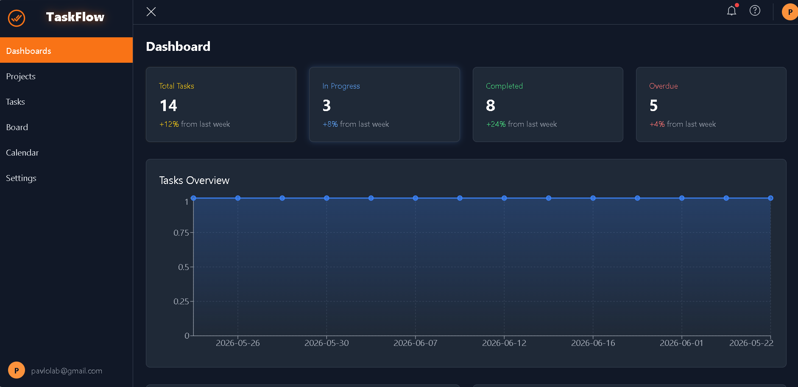
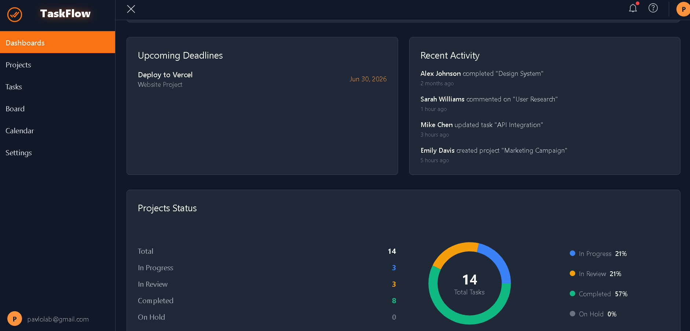
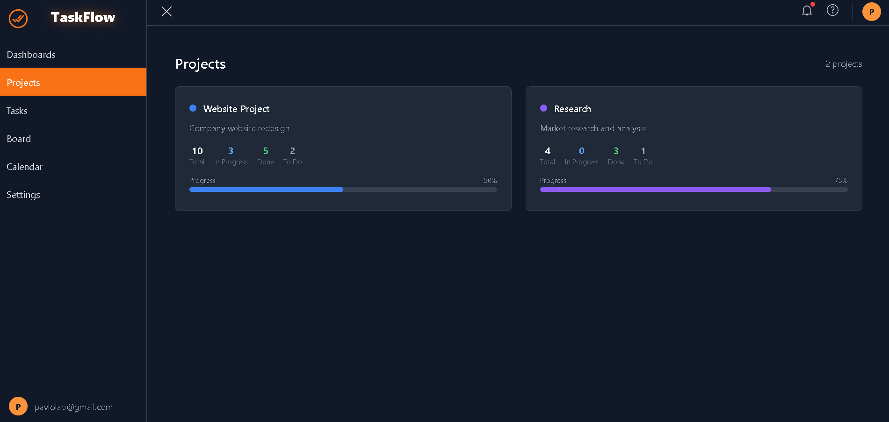
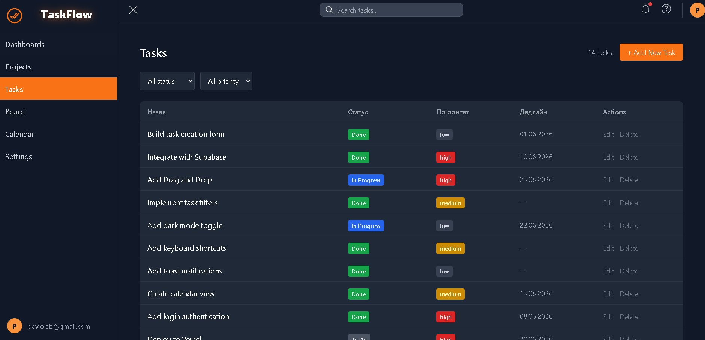
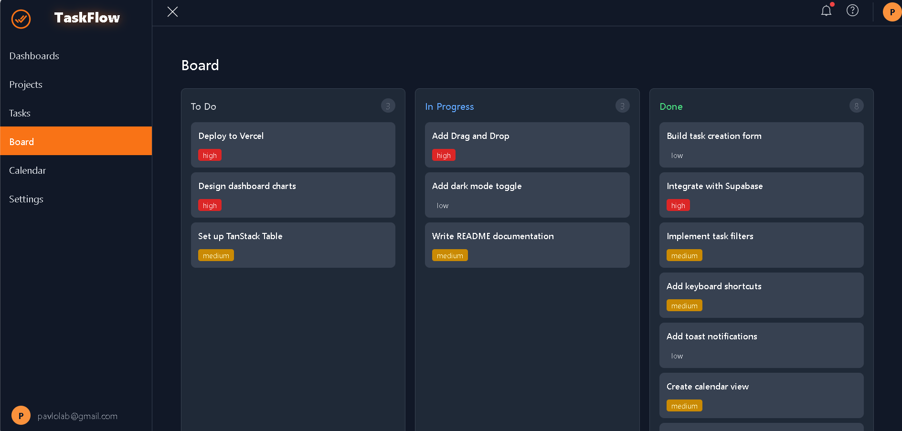
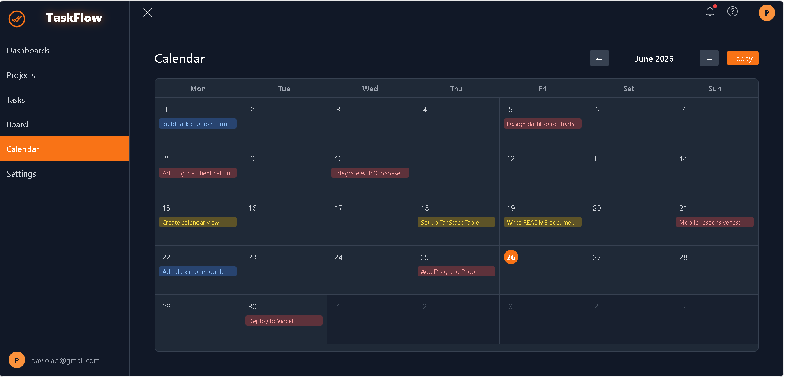
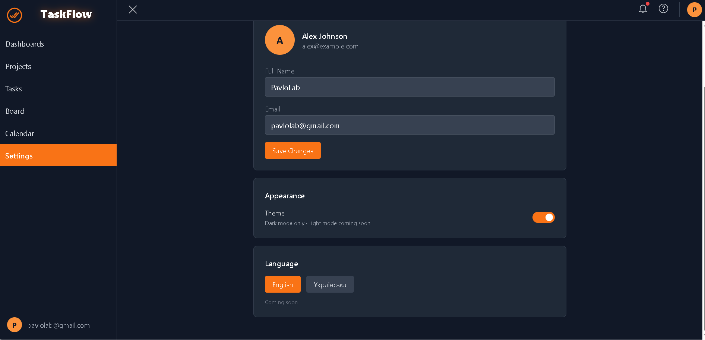
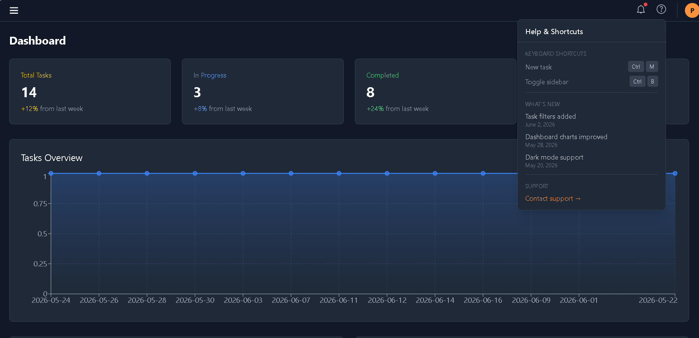
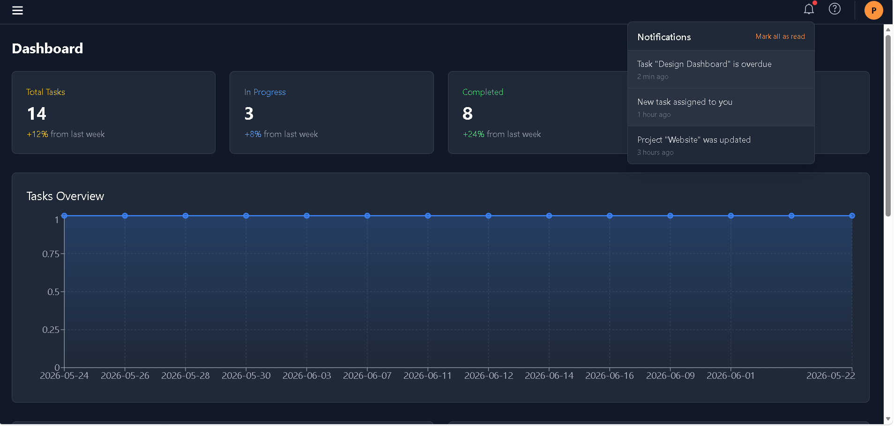
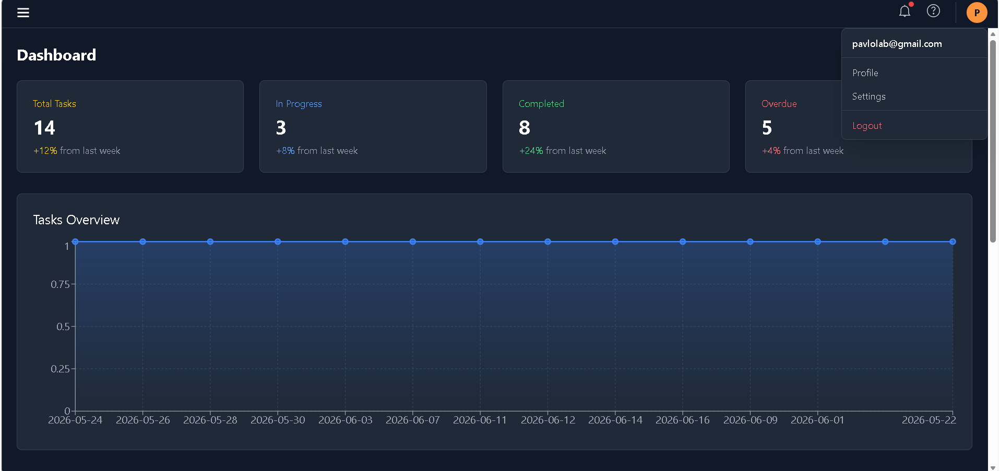

TaskFlow — Task Management Dashboard

A modern task management dashboard built with React and TypeScript.

🔗 Live Demo: [dashboard-app-ochre-eta.vercel.app](https://dashboard-app-ochre-eta.vercel.app/dashboards)

## Screenshots

Features

Dashboard — statistics, task trends chart, upcoming deadlines, project status
Tasks — table view with filters by status and priority, search, create, edit and delete tasks
Board — Kanban board with drag & drop between columns
Projects — project cards with task progress bars
Calendar — monthly view with task deadlines, click to view task details
Settings — profile and appearance settings
Authentication — login/logout with protected routes
Keyboard shortcuts — Ctrl+B toggle sidebar, Ctrl+M open new task
Notifications — toast messages for all actions
Responsive — works on mobile and desktop

Tech Stack

React 19 + TypeScript
Vite — build tool
Tailwind CSS — styling
Zustand — state management
React Router — routing
Supabase — database and API
Recharts — charts
date-fns — date utilities
@dnd-kit — drag and drop
react-icons — icons

Getting Started

bashgit clone https://github.com/pavlolab/dashboard-app.git
cd dashboard-app
npm install
npm run dev

Create .env file in the root:

VITE_SUPABASE_URL=your_supabase_url
VITE_SUPABASE_ANON_KEY=your_supabase_anon_key

Demo Login

Email: any valid email
Password: any password with 4+ characters

Author

Pavlo — GitHub
